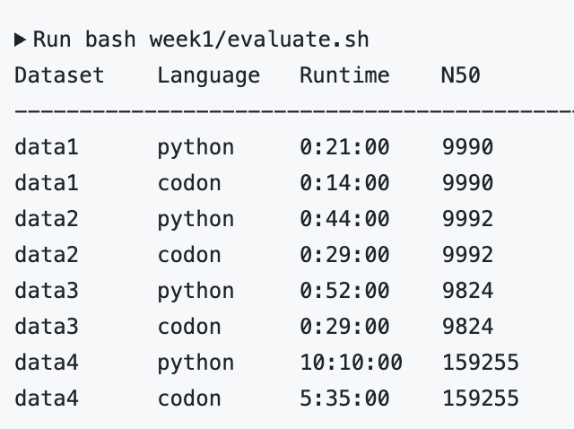

# Folder structure

code -> contains 'ported' code files, along with my implementation of a n50 calculator
data -> contains all data files
resources -> contains a copy of the relevant code files used in the repository we were asked to clone
tests -> files that capture output of python and codon scripts to calculate n50 more efficiently

# Library integration

os module -> could not execute os.path.join in Codon so ommited it
sys module -> could not execute sys.setrecursionlimit in Codon so ommited it

# Porting

Most of the differences between Python and Codon for this deliverable seemed to stem from typing correctly.
It was particularly important to type classes and their attributes appropriately, as otherwise, program would not compile.

For example, when I wrote the DBG class and wanted to reference the Node class as the type for one of its attributes,
I encountered an error as I had not assigned types to Node's attributes yet. It wasn't until after I assigned classes
to Node's attributes that I was able to reference it as a type for the DBG class.

# Setting stack size

I ran into some issues when running the script for data4, as indicated by the original repository's README I had to
modify the soft stack size in my terminal session. However, I could not run the specific command given in the README
(ulimit -s 8192000) as the stack size specified there exceeded the hard limit of the stack size for my device. Therefore,
I instead used "ulimit -s unlimited" locally. However, on my Github repository, I encountered a segmentation fault when
running the codon script for data4, so I had to add "uliulimit -s 8192000", as instructed, to my bash script.

# Results

Both python and codon scripts reported the same N50 values for all 4 datasets. Codon showed a considerable speedup for
all datasets.
